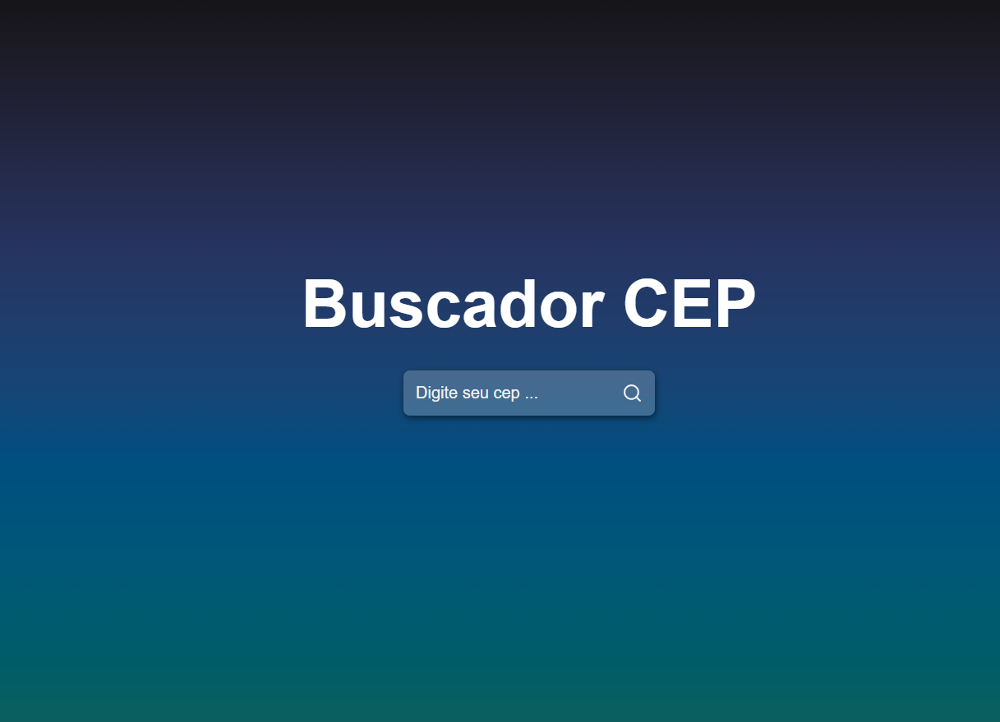

# 🔎 Buscador de CEP
Um projeto teve como objetivo, como criar um buscador de CEP no React.

Esse projeto é parte do video que foi disponibilizado no canal do youtube.

<p align="center">
  
</p>


## 🛠 Tecnologias

As seguintes ferramentas foram usadas na construção do projeto:

- CSS3
- JavaScript
- React
- Api Axios

## ✅ Pré-requisitos para clonar

- [Git](https://git-scm.com)
- Editor de texto - para melhor visualização do código fonte


### 🔁 Como clonar em sua máquina?
Acesse o terminal e digite os seguintes comando:

Clone este repositório
```bash
git clone https://github.com/Ingridaquino/BUSCADOR-CEP.git buscador-cep
```

Em seguida acesse o repositório com o comando:
```bash
cd buscador-cep
```

